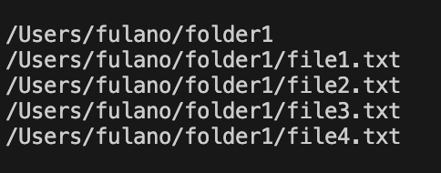
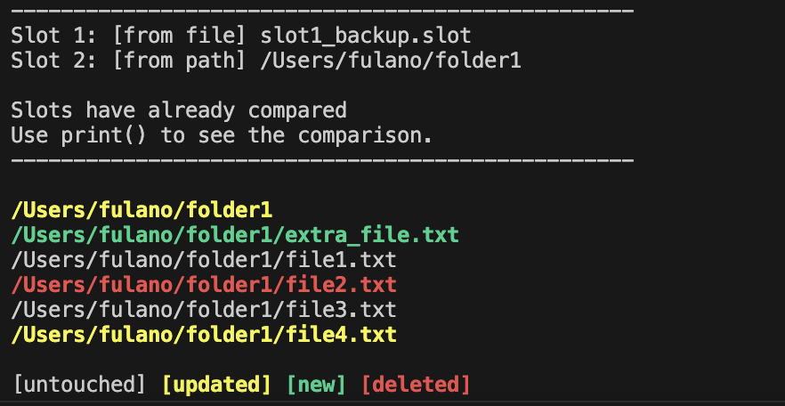

# Directory Tools
This is a simple python script to extract directory's info. The info can be used to compare the previous directory structure to the current structure highlighting the **updated**, **new** and **deleted** files and folders.

## Running in terminal
First you can save any directory structure to a file that can be used to future comparison.
```bash
python DirectoryTools --loadpath /Users/fulano/folder1 --exportslot1 slot1_backup.slot 
```
This will create a file called `slot1_backup.slot` containing the directory's info and print the structure in the terminal.



Now let's make some changes in this folder. For example, we can delete `file2.txt`, create a new file called `extra_file.txt` and modify the content of `file4.txt`

So let's use the backup file `slot1_backup.slot` to see what has changed in folder1
```bash
python DirectoryTools --loadfile slot1_backup.slot --loadpath /Users/fulano/folder1
```
This time we used two arguments to set the folders. `--loadfile` or `-lf` will set a file that contains the folder structure, in this case the backup file that we created previously. `--loadpath` or `-lp` will load a folder by path.

The result will be printed as below.




This is a simple script that can be optimized and more functionalities can be added in the future. For now, it's a simple project to practice some programming skills.

**Thank you for visit this page!**